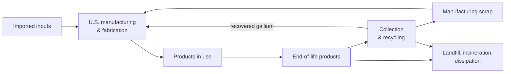

# Secondary Sources of Gallium

Analysis of secondary gallium sources and their recovery potential, using material flow analysis and computational methods.

Undergraduate research by **Venance Komu** at the Inamori School of Engineering, Alfred University (May – Jul 2026).

## Why gallium

Gallium goes into GaAs and GaN semiconductors, LEDs, and RF and power electronics. The United States has not produced primary gallium since 1987 and relies on imports, so gallium that could be recovered from manufacturing scrap and end-of-life products is worth measuring.

## What the project does

- **Data.** Compiles and cleans data on secondary gallium sources in Python (pandas, NumPy) and Excel, and uses descriptive statistics to compare materials and their potential for recovery.
- **Material Flow Analysis (MFA).** Models gallium flows and availability across secondary sources, to assess what they could contribute to the U.S. gallium supply chain.
- **Uncertainty.** Runs a Monte Carlo uncertainty analysis on the MFA.
- **XRF.** Analyzes X-ray fluorescence measurements with Python scripts and Matplotlib to compare gallium concentrations across candidate materials.

## System boundary

The stages the MFA tracks, and how gallium moves between them:

Every stage also exchanges gallium with other countries through exports and imports. **Imported inputs** are gallium metal, GaAs, GaN, wafers and other gallium compounds. **Manufacturing & fabrication** covers IC fabrication, RF devices, GaN/GaAs power electronics, LED chips, optoelectronics and solar cells. **Products in use** covers cellular base stations, smartphones, LED lighting, power electronics, RF and telecom equipment, and defense and aerospace systems.

## Tools

Python (pandas, NumPy, Matplotlib) · Excel · Git

## Status

The analysis code and figures are being added to this repository.

## Author

Venance Komu · B.S. Electrical Engineering & Mathematics, Alfred University · [LinkedIn](https://linkedin.com/in/venance-komu) · [Website](https://venancekomu03-hub.github.io)
